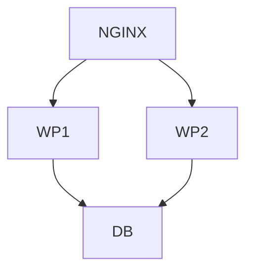

## Topology



## Goal

Mencoba load balancing wordpress. Load test dengan k6.

## Running it

```
vagrant up
```

## Testing with k6

Run k6 dengan 20 virtual users dalam waktu 30 detik

```
k6 run -u 20 -d 30s stress.js
```